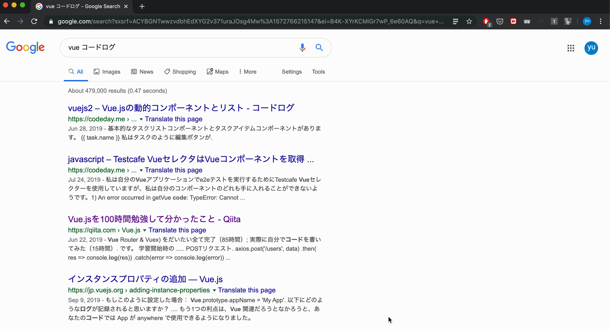
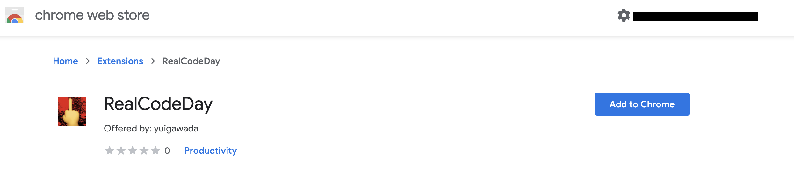

<h2 align="center"> RealCodeDay </h2>

  

A chrome extension that make it easier to access to the source site of Code Day(コードログ) directly.

海外サイトをただ翻訳しただけの害悪なサイト”コードログ(CodeDay)”のページから一瞬で翻訳元に飛べるchrome拡張です。

インストール後、コードログ(CodeDay)のページに飛ぶと自動で翻訳元のページに飛んでくれます。

## Demo

  

## Installation

[こちら](https://chrome.google.com/webstore/detail/realcodeday/hbpanmdcaepbocfpjhaococmomieadko)からインストールできます

  

CodeDayは一見害悪に見えますが、見方を変えれば、日本語で検索しても英語の記事を引っ掛けてくれるという便利さがあるわけです。しかし、翻訳元のページを探し出すのはわずか数ステップではありつつも、すごくストレスの溜まるプロセスであり、かといって翻訳の質はそこまで高くもなく、原文で読みたい。

そこでこのchrome拡張をつくることにしました。
既出だったらすいません。

 
 

Developed by [Yuiga Wada](https://yuiga.dev)

Chrome Web Store: <https://chrome.google.com/webstore/detail/realcodeday/hbpanmdcaepbocfpjhaococmomieadko>

Source Code: <https://github.com/YuigaWada/RealCodeDay>
